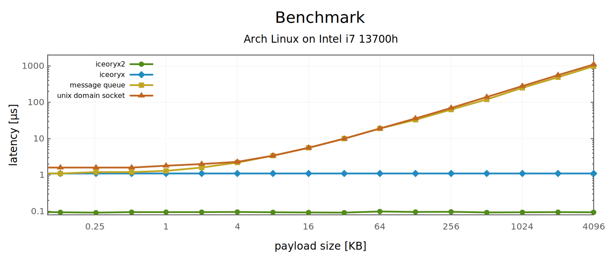
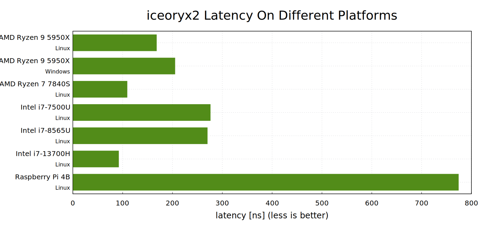

<!-- markdownlint-disable -->

[](https://github.com/eclipse-iceoryx/iceoryx2/actions/workflows/build-test.yml?query=branch%3Amain++)
[](https://cirrus-ci.com/github/eclipse-iceoryx/iceoryx2/main)
[](https://codecov.io/gh/eclipse-iceoryx/iceoryx2?branch=main)
[](benchmarks/README.md)
[](CHANGELOG.md)
[](https://crates.io/crates/iceoryx2)
[](examples/)
[](FAQ.md)
[](https://gitter.im/eclipse/iceoryx)
[](https://opensource.org/licenses/Apache-2.0)
[](ROADMAP.md)

<p align="center">

</p>

<!-- markdownlint-enable -->

# iceoryx2 - Zero-Copy Lock-Free IPC Purely Written In Rust

* [iceoryx2 - Zero-Copy Lock-Free IPC Purely Written In Rust](#iceoryx2---zero-copy-lock-free-ipc-purely-written-in-rust)
    * [Introduction](#introduction)
    * [Documentation](#documentation)
    * [Performance](#performance)
        * [Comparision Of Mechanisms](#comparision-of-mechanisms)
            * [Benchmark-System](#benchmark-system)
        * [Comparision Of Architectures](#comparision-of-architectures)
    * [Getting Started](#getting-started)
        * [Publish Subscribe](#publish-subscribe)
            * [publisher.rs](#publisherrs)
            * [subscriber.rs](#subscriberrs)
        * [Events](#events)
            * [notifier.rs](#notifierrs)
            * [listener.rs](#listenerrs)
            * [listener.rs (grabbing all events at once)](#listenerrs-grabbing-all-events-at-once)
        * [Custom Configuration](#custom-configuration)
    * [Supported Platforms](#supported-platforms)
    * [Language Bindings](#language-bindings)
    * [Commercial Support](#commercial-support)
    * [Thanks To All Contributors](#thanks-to-all-contributors)

## Introduction

Welcome to iceoryx2, the efficient, and ultra-low latency inter-process
communication middleware. This library is designed to provide you with fast and
reliable zero-copy and lock-free inter-process communication mechanisms.

So if you want to communicate efficiently between multiple processes or
applications iceoryx2 is for you. With iceoryx2, you can:

* Send huge amounts of data using a publish/subscribe, request/response,
  pipeline (planned) or blackboard pattern (planned), making it ideal
  for scenarios where large datasets need to be shared.
* Exchange signals through events, enabling quick and reliable signaling between
  processes.

iceoryx2 is based on a service-oriented architecture (SOA) and facilitates
seamless inter-process communication (IPC).

It is all about providing a seamless experience for inter-process communication,
featuring versatile messaging patterns. Whether you're diving into
publish-subscribe, events, or the promise of upcoming features like
request-response, pipelines, and blackboard, iceoryx2 has you covered.

One of the features of iceoryx2 is its consistently low transmission latency
regardless of payload size, ensuring a predictable and reliable communication
experience.

iceoryx2's origins can be traced back to
[iceoryx](https://github.com/eclipse-iceoryx/iceoryx). By overcoming past
technical debts and refining the architecture, iceoryx2 enables the modularity
we've always desired.

In the near future, iceoryx2 is poised to support at least the same feature set
and platforms as [iceoryx](https://github.com/eclipse-iceoryx/iceoryx), ensuring
a seamless transition and offering enhanced capabilities for your inter-process
communication needs. So, if you're looking for lightning-fast, cross-platform
communication that doesn't compromise on performance or modularity, iceoryx2 is
your answer.

## Documentation

The documentation can be found at:

| language |                          documentation link |
| :------: | ------------------------------------------: |
|    C     |           <https://iceoryx2.readthedocs.io> |
|   C++    |           <https://iceoryx2.readthedocs.io> |
|   Rust   | <https://docs.rs/iceoryx2/latest/iceoryx2/> |

## Performance

### Comparision Of Mechanisms



#### Benchmark-System

* **CPU:** Intel i7 13700h
* **OS:** Linux 6.10.10-arch1-1 #1 SMP PREEMPT_DYNAMIC
* **Compiler:**
    * rustc 1.81.0
    * gcc 14.2.1 20240910

### Comparision Of Architectures



## Getting Started

### Publish Subscribe

This minimal example showcases a publisher sending the number 1234 every second,
while a subscriber efficiently receives and prints the data.

#### publisher.rs

```rust
use core::time::Duration;
use iceoryx2::prelude::*;

const CYCLE_TIME: Duration = Duration::from_secs(1);

fn main() -> Result<(), Box<dyn std::error::Error>> {
    let node = NodeBuilder::new().create::<ipc::Service>()?;

    let service = node.service_builder(&"My/Funk/ServiceName".try_into()?)
        .publish_subscribe::<usize>()
        .open_or_create()?;

    let publisher = service.publisher_builder().create()?;

    while node.wait(CYCLE_TIME).is_ok() {
        let sample = publisher.loan_uninit()?;
        let sample = sample.write_payload(1234);
        sample.send()?;
    }

    Ok(())
}
```

#### subscriber.rs

```rust
use core::time::Duration;
use iceoryx2::prelude::*;

const CYCLE_TIME: Duration = Duration::from_secs(1);

fn main() -> Result<(), Box<dyn std::error::Error>> {
    let node = NodeBuilder::new().create::<ipc::Service>()?;

    let service = node.service_builder(&"My/Funk/ServiceName".try_into()?)
        .publish_subscribe::<usize>()
        .open_or_create()?;

    let subscriber = service.subscriber_builder().create()?;

    while node.wait(CYCLE_TIME).is_ok() {
        while let Some(sample) = subscriber.receive()? {
            println!("received: {:?}", *sample);
        }
    }

    Ok(())
}
```

This example is a simplified version of the
[publish-subscribe example](examples/rust/publish_subscribe/). You can execute
it by opening two terminals and calling:

**Terminal 1:**

```sh
cargo run --example publish_subscribe_publisher
```

**Terminal 2:**

```sh
cargo run --example publish_subscribe_subscriber
```

### Request Response

This example showcases a client sending a request with the number 123 every
second, while a server responds with the number 456 as soon as it receives
the request.

#### client.rs

```rust
use core::time::Duration;
use iceoryx2::prelude::*;

const CYCLE_TIME: Duration = Duration::from_secs(1);

fn main() -> Result<(), Box<dyn core::error::Error>> {
    let node = NodeBuilder::new().create::<ipc::Service>()?;

    let service = node
        .service_builder(&"My/Funk/ServiceName".try_into()?)
        .request_response::<u64, u64>()
        .open_or_create()?;

    let client = service.client_builder().create()?;

    // send first request
    let request = client.loan_uninit()?;
    let request = request.write_payload(1234);
    let mut pending_response = request.send()?;

    while node.wait(CYCLE_TIME).is_ok() {
        // acquire all responses to our request from our buffer that were sent by the servers
        while let Some(response) = pending_response.receive()? {
            println!("  received response: {:?}", *response);
        }

        // send another request
        let request = client.loan_uninit()?;
        let request = request.write_payload(123);
        pending_response = request.send()?;
   }

    Ok(())
}
```

#### server.rs

```rust
use core::time::Duration;
use iceoryx2::prelude::*;

const CYCLE_TIME: Duration = Duration::from_millis(100);

fn main() -> Result<(), Box<dyn core::error::Error>> {
    let node = NodeBuilder::new().create::<ipc::Service>()?;

    let service = node
        .service_builder(&"My/Funk/ServiceName".try_into()?)
        .request_response::<u64, u64>()
        .open_or_create()?;

    let server = service.server_builder().create()?;

    while node.wait(CYCLE_TIME).is_ok() {
        while let Some(active_request) = server.receive()? {
            let response = active_request.loan_uninit()?;
            let response = response.write_payload(456)
            response.send()?;
        }
    }

    Ok(())
}
```

This example is a simplified version of the
[request response example](examples/rust/request_response/). You can execute it
by opening two terminals and calling:

**Terminal 1:**

```sh
cargo run --example request_response_client
```

**Terminal 2:**

```sh
cargo run --example request_response_server
```

### Events

This minimal example showcases how push-notifications can be realized by using
services with event messaging pattern between two processes. The `listener.rs`
hereby waits for a notification from the `notifier.rs`.

#### notifier.rs

```rust
use core::time::Duration;
use iceoryx2::prelude::*;

const CYCLE_TIME: Duration = Duration::from_secs(1);

fn main() -> Result<(), Box<dyn std::error::Error>> {
    let node = NodeBuilder::new().create::<ipc::Service>()?;

    let event = node.service_builder(&"MyEventName".try_into()?)
        .event()
        .open_or_create()?;

    let notifier = event.notifier_builder().create()?;

    let id = EventId::new(12);
    while node.wait(CYCLE_TIME).is_ok() {
        notifier.notify_with_custom_event_id(id)?;

        println!("Trigger event with id {:?} ...", id);
    }

    Ok(())
}
```

#### listener.rs

```rust
use core::time::Duration;
use iceoryx2::prelude::*;

const CYCLE_TIME: Duration = Duration::from_secs(1);

fn main() -> Result<(), Box<dyn std::error::Error>> {
    let node = NodeBuilder::new().create::<ipc::Service>()?;

    let event = node.service_builder(&"MyEventName".try_into()?)
        .event()
        .open_or_create()?;

    let listener = event.listener_builder().create()?;

    while node.wait(Duration::ZERO).is_ok() {
        if let Ok(Some(event_id)) = listener.timed_wait_one(CYCLE_TIME) {
            println!("event was triggered with id: {:?}", event_id);
        }
    }

    Ok(())
}
```

#### listener.rs (grabbing all events at once)

```rust
use core::time::Duration;
use iceoryx2::prelude::*;

const CYCLE_TIME: Duration = Duration::from_secs(1);

fn main() -> Result<(), Box<dyn std::error::Error>> {
    let node = NodeBuilder::new().create::<ipc::Service>()?;

    let event = node.service_builder(&"MyEventName".try_into()?)
        .event()
        .open_or_create()?;

    let listener = event.listener_builder().create()?;

    while node.wait(Duration::ZERO).is_ok() {
        listener.timed_wait_all(
            |event_id| {
                println!("event was triggered with id: {:?}", event_id);
            },
            CYCLE_TIME,
        )?;
    }

    Ok(())
}
```

This example is a simplified version of the
[event example](examples/rust/event/). You can execute it by opening two
terminals and calling:

**Terminal 1:**

```sh
cargo run --example event_notifier
```

**Terminal 2:**

```sh
cargo run --example event_listener
```

### Custom Configuration

It is possible to configure default quality of service settings, paths and file
suffixes in a custom configuration file. For more details visit the
[configuration directory](config/).

## Supported Platforms

The support levels can be adjusted when required.

| Operating System | State   | Current Support Level | Target Support Level |
| ---------------- | :------ | :-------------------: | -------------------: |
| Android          | planned |           -           |               tier 1 |
| FreeBSD          | done    |        tier 2         |               tier 1 |
| FreeRTOS         | planned |           -           |               tier 2 |
| iOS              | planned |           -           |               tier 2 |
| Linux (x86_64)   | done    |        tier 2         |               tier 1 |
| Linux (aarch64)  | done    |        tier 2         |               tier 1 |
| Linux (32-bit)   | done    |        tier 2         |               tier 1 |
| Mac OS           | done    |        tier 2         |               tier 2 |
| QNX              | planned |           -           |               tier 1 |
| VxWorks          | planned |           -           |               tier 1 |
| WatchOS          | planned |           -           |               tier 2 |
| Windows          | done    |        tier 2         |               tier 2 |

* **tier 1** - All safety and security features are working.
* **tier 2** - Works with a restricted security and safety feature set.
* **tier 3** - Work in progress. Might compile and run or not.

## Language Bindings

| Language |   State |
| -------- | ------: |
| C / C++  |    done |
| Python   | planned |
| Go       | planned |
| C#       | planned |
| Java     | planned |
| Kotlin   | planned |
| Lua      | planned |
| Swift    | planned |
| Zig      | planned |

## Commercial Support

<!-- prettier-ignore-start -->
<!-- markdownlint-disable -->

<table width="100%">
  <tbody>
    <tr>
      <td align="center" valign="top" width="33%">
        <a href="https://ekxide.io">
        <br />
        </a>
        <a href="mailto:info@ekxide.io">info@ekxide.io</a>
      </td>
      <td>
        <ul>
          <li>commercial extensions and tooling</li>
          <li>custom feature development</li>
          <li>training and consulting</li>
          <li>integration support</li>
          <li>engineering services around the iceoryx ecosystem</li>
        </ul>
      </td>
    </tr>
  </tbody>
</table>

<!-- markdownlint-restore -->
<!-- prettier-ignore-end -->

## Thanks To All Contributors

<!-- prettier-ignore-start -->
<!-- markdownlint-disable -->

<table>
  <tbody>
    <tr>
      <td align="center" valign="top" width="14.28%">
          <a href="https://github.com/elfenpiff">
          <br />
          <sub><b>Christian »elfenpiff« Eltzschig</b></sub></a></td>
      <td align="center" valign="top" width="14.28%">
          <a href="https://github.com/elboberido">
          <br />
          <sub><b>Mathias »elBoberido« Kraus</b></sub></a></td>
      <td align="center" valign="top" width="14.28%">
          <a href="https://github.com/orecham">
          <br />
          <sub><b>»orecham«</b></sub></a></td>
      <td align="center" valign="top" width="14.28%">
          <a href="https://github.com/FerdinandSpitzschnueffler">
          <br />
          <sub><b>»FerdinandSpitzschnueffler«</b></sub></a></td>
    </tr><tr>
      <td align="center" valign="top" width="14.28%">
          <a href="https://github.com/xieyuschen">
          <br />
          <sub><b>»xieyuschen«</b></sub></a></td>
      <td align="center" valign="top" width="14.28%">
          <a href="https://github.com/brosier01">
          <br />
          <sub><b>Bruce »brosier01« Rosier</b></sub></a></td>
      <td align="center" valign="top" width="14.28%">
          <a href="https://github.com/hanky-qorix">
          »hanky«"/><br />
          <sub><b>»hanky«</b></sub></a></td>
    </tr>
  </tbody>
</table>

<!-- markdownlint-restore -->
<!-- prettier-ignore-end -->
